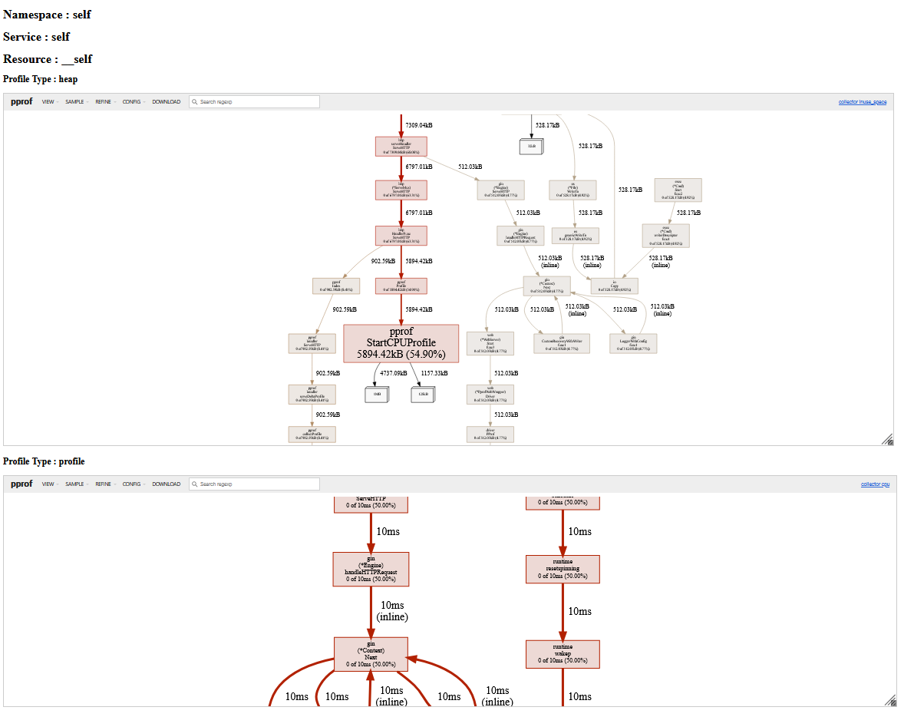

# pprof-controller

Continuous profiling for Golang services using a k8s imperative API

⚠️ : This is a pre-alpha, extremely unstable version


## Pprof Collector

Pprof collector continuously collects pprof profiles from endpoints, using the following config structure:
```yaml
self_telemetry:
  pprof_port : 7000
  interval_seconds : 5
monitors:
  - name : test
    endpoint : http://localhost:6060
    profile:
      seconds : 5
    allocs:
      seconds : 5
```

## Controller

### Collector

The controller deploys a pprof collector stack using a CRD:
```yaml
apiVersion: resources.cattle.io/v1alpha1
kind : PprofCollectorStack
metadata:
  name: pprofmonitor-stack
  namespace: pprof-controller
spec:
  storage:
    diskSpace : 5Gi
  collectorImage:
    registry: docker.io
    repo: alex7285
    image : pprof-collector
    tag : dev
    sha : "sha256:64bfd97aa9ae8eef262a50d133805341062e1d89d83e696ed81ed02c22bc6589"
    imagePullPolicy: "Always"
  reloaderImage:
    registry : "ghcr.io"
    repo: "jimmidyson"
    image: "configmap-reload"
    tag: "dev"
    sha : ""
    imagePullPolicy: "Always"
```

### Collecting

The controller discovers pprof targets in Kubernetes clusters by using a CRD analogous to Prometheus' [ServiceMonitor](https://prometheus-operator.dev/docs/api-reference/api/#monitoring.coreos.com/v1.ServiceMonitor) for collecting from endpoints

For example:

```yaml
apiVersion: resources.cattle.io/v1alpha1
kind : PprofMonitor
metadata:
  name: pprofmonitor-sample
  namespace: default
spec:
  selector:
    matchLabels:
      app: pprof
  namespaceSelector:
    any : true
  endpoint:
    targetPort : 80
  config:
    profile:
      seconds : 120
    heap:
      seconds : 120
```

collects profiles from any namespace, from services matching the label select `app : pprof`, from the exposed port `targetPort`, in this case `80`.


## Development

### local

```sh
make local
```

open UI served at `localhost:8989`

### Image

To build your own collector image

```sh
REGISTRY=<your-registry> REPO=<your-repo> TAG=<your-tag> make build
```

To build and push:
```sh
REGISTRY=<your-registry> REPO=<your-repo> TAG=<your-tag> make push
```

### K8s

```sh
make build
kubectl create ns pprof-controller
KUBECONFIG=$KUBECONFIG ./bin/operator
kubectl apply -f ./examples/manifests/
```
After a couple minutes profiles should start showing up in the UI:
```sh
kubectl port-forward -n pprof-controller svc/pprof-operator-collector 8989:8989
```

and you should get a UI like:

